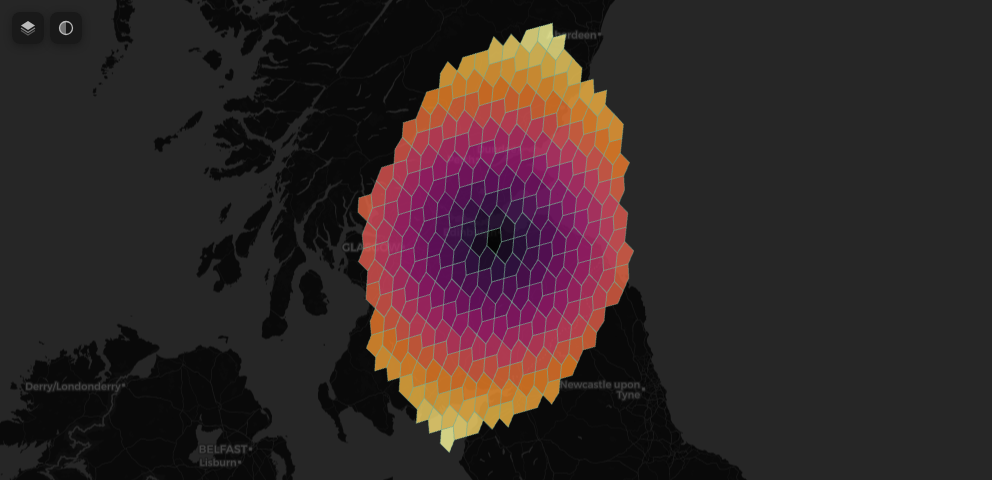

<!-- README.md is generated from README.Rmd. Please edit that file -->

# a5view

<!-- badges: start -->

[](https://lifecycle.r-lib.org/articles/stages.html#experimental)
[](https://github.com/belian-earth/a5view/actions/workflows/R-CMD-check.yaml)
<!-- badges: end -->

Interactive map viewer for [A5](https://a5geo.org) geospatial cells,
powered by [deck.gl](https://deck.gl). Renders cells directly in the
browser using deck.gl’s native A5Layer — no pre-computation of
boundaries needed. Intentionally minimal API for fast prototyping and
exploration of A5 data.

## Installation

``` r
# install.packages("pak")
pak::pak("belian-earth/a5view")
```

## Usage

``` r
library(a5R)
library(a5view)

# Pick a cell and expand to a disk
cell <- a5_lonlat_to_cell(-3.19, 55.95, resolution = 9)
disk <- a5_grid_disk(cell, k = 10) |>
  a5_uncompact(resolution = 9)

# Colour by distance from centre
a5_view(disk, fill = a5_cell_distance(cell, disk), palette = "Inferno")
```



Features:

- Colour mapping from numeric vectors or data frame columns with any
  `hcl.colors()` palette
- Interactive basemap selector (dark, light, OSM, satellite)
- Opacity slider
- Tooltip with cell ID on click, fill value on hover
- Cell border styling
- 3D extrusion via `elevation`
- Shiny bindings (`a5_viewOutput` / `renderA5_view`)
